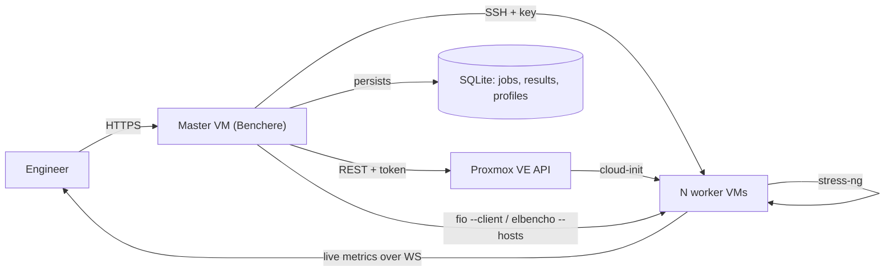

<div align="center">

# Benchere

**Infrastructure benchmark toolkit for virtualization engineers.**

Provision ephemeral workers, run distributed storage and CPU benchmarks against a Proxmox cluster, deliver a presentable PDF report.

[](https://github.com/Leumas-LSN/benchere/releases/latest)
[](https://github.com/Leumas-LSN/benchere/actions)
[](go.mod)
[](web/package.json)
[](LICENSE)

[Quick start](#quick-start) · [Features](#features) · [Architecture](#architecture) · [Build from source](#build-from-source) · [Roadmap](#roadmap)

</div>

---

## Why Benchere

Storage and CPU performance validation on a freshly delivered Proxmox cluster is traditionally a manual chore: SSH into a node, run a script, eyeball the numbers, transcribe them into a slide deck. Results are inconsistent, comparisons across clients are impossible, and there is no presentable artifact at the end.

Benchere standardizes the workflow:

- **One job** describes target nodes, a worker shape, the storage pools to test, and the benchmark profiles to run.
- **One report** comes out — a dark-themed PDF with per-profile pass/fail verdicts based on configurable thresholds.
- **One binary** runs the whole stack: REST API, WebSocket live feed, embedded Vue 3 frontend, SQLite persistence.

## Quick start

The installer runs on any Debian 12+ or Ubuntu 22.04+ VM or LXC container with internet access. From the target machine, as root:

```bash
curl -fsSL https://github.com/Leumas-LSN/benchere/releases/latest/download/install.sh | sudo bash
```

Then open `http://<vm-ip>/` in a browser. The first visit launches a six-step onboarding wizard:

1. **Language** — French or English (persisted, switchable later).
2. **Hypervisor** — Proxmox today; vSphere, Hyper-V and Azure Local listed as upcoming targets.
3. **Cluster connection** — API URL, token id/secret, default deployment node, cluster identifier.
4. **Worker network** — bridge, static IP pool, CIDR, gateway.
5. **SSH key path** — used by Ansible to reach the worker VMs.
6. **Done** — review and finish.

Once the wizard finishes, the dashboard is ready and the **New job** flow becomes available.

## Features

| Capability | Detail |
|---|---|
| Dual benchmark engine | `fio` (default since v1.11.0) for full latency percentiles and battle-tested distributed mode, with `elbencho` kept as a legacy alternative selectable at job creation. |
| Storage benchmarks | Distributed runs across N workers, IOPS read/write, throughput, latency p50 / p95 / p99 from the engine of your choice. |
| CPU benchmarks | `stress-ng` over SSH on the workers, configurable stressors and timeouts. |
| Multi-node workloads | One job spans multiple Proxmox nodes (since v1.8.0), workers distributed round-robin with parallel provisioning bounded by errgroup. |
| Thin-volume prefill | Sequential write pass before any read profile, allocating every extent so reads measure the real backend instead of the librbd / ZFS / LVM-thin zero-block fast path. |
| Worker lifecycle | Cloud-init provisioning from a Debian generic image, static IP allocation from a user-defined pool, automatic teardown after the job completes. |
| Live progress | WebSocket-driven dashboard with per-phase progress bar (provisioning, prefill, each profile with ETA), collapsible logs panel, live IOPS / throughput / latency charts. |
| Profile thresholds | Each profile carries optional pass/fail thresholds (min IOPS, max latency) that drive the verdict in the report. |
| Multi-pool runs | Pick several storage pools at job creation; one independent run per pool, named for unambiguous comparison. |
| Debug bundle | One-click export per job (`GET /api/jobs/{id}/debug`) returning a tar.gz with the SQLite snapshot, fio / elbencho raw stdout / stderr / jobfile, ansible logs, per-worker sysinfo (lsblk, mount, dmesg, qm config), Proxmox cluster snapshot, best-effort Ceph status. Settings are scrubbed before export. |
| PDF & HTML reports | Dark-themed by default, switchable to print mode. Localized to the user's chosen language. |
| Internationalization | Full FR / EN locales for the UI and the reports. |

## Benchmark engines

Two engines are available, selectable per-job at creation time:

- **fio** (default since v1.11.0). Full clat percentiles in JSON+, native `--client/--server` distributed mode, anti-dedup buffers via `refill_buffers=1`. Profiles use `numjobs=1 iodepth=128`, the HCIBench / Ceph upstream pattern for block-device benchmarks.
- **elbencho** (legacy, kept for continuity). Native distributed mode and live CSV streaming. Most appropriate for filesystem-walk metadata workloads, less so for block-device benchmarking.

Both engines are installed on every worker by Ansible. The selection only changes which engine the master coordinates from.

## Architecture



Single Go binary, single deployable artifact:

```
cmd/benchere/        entry point
internal/
  api/               REST + WebSocket handlers
  proxmox/           Proxmox VE API client
  ansible/           Ansible runner
  fio/               fio runner, JSON+ parser, prefill (since v1.11.0)
  elbencho/          orchestration + live CSV parser (legacy engine)
  stress/            stress-ng over SSH
  benchmark/         job orchestrator, multi-node split, IP allocator
  report/            HTML/PDF rendering + SVG charts (Chromium headless)
  debug/             debug bundle assembler, scrubbing, ceph + proxmox collectors
  ws/                WebSocket hub
  db/                SQLite migrations + queries
web/                 Vue 3 + Tailwind source (embedded via go:embed)
ansible/             worker provisioning playbooks
```

## Stack

- **Backend** — Go 1.25, Gorilla WebSocket, `modernc.org/sqlite` (pure Go, no CGO).
- **Frontend** — Vue 3 Composition API, Pinia, Vue Router, Tailwind CSS, Vite, vue-i18n.
- **Provisioning** — Ansible 2.x, Proxmox VE 8/9 REST API, cloud-init NoCloud.
- **Storage benchmark** — [fio](https://github.com/axboe/fio) (default since v1.11.0, distributed via `--client/--server`) or [elbencho](https://github.com/breuner/elbencho) (legacy, still supported).
- **CPU benchmark** — [stress-ng](https://github.com/ColinIanKing/stress-ng) over SSH.
- **PDF rendering** — Chromium headless (since v1.7.3).
- **CI** — GitHub Actions builds the Linux/amd64 binary on every tag, attaches it alongside `install.sh` to the release.

## Screenshots

Screenshots of the live dashboard, the job wizard and the PDF report are available in [`docs/screenshots/`](docs/screenshots/).

## Build from source

Prerequisites: Go 1.25+, Node.js 20+, npm, GNU Make.

```bash
git clone https://github.com/Leumas-LSN/benchere.git
cd benchere
make build       # builds web/dist via Vite, then the Go binary
make test
```

The binary embeds the frontend bundle via `//go:embed`. Any change in `web/src/` requires a Go rebuild to take effect at runtime.

To produce a versioned release locally:

```bash
make build VERSION=v1.12.0  # stamps main.Version via -ldflags
```

## Configuration

Runtime configuration is read from a few environment variables (defaults in parentheses):

| Variable | Default | Purpose |
|---|---|---|
| `BENCHERE_PORT` | `80` | HTTP listen port |
| `BENCHERE_DB` | `/opt/benchere/benchere.db` | SQLite database path |
| `BENCHERE_DEBUG` | `false` | Verbose request logging |
| `BENCHERE_SSH_KEY` | `/opt/benchere/id_rsa` | Private key Ansible uses to reach workers |

All other settings (Proxmox URL/token/node, storage, network bridge, IP pool, cluster name) live in the SQLite database and are managed through the onboarding wizard or the **Settings** page.

## Roadmap

V1 (current) targets Proxmox VE in an internal-network deployment without authentication. The next iterations are:

- A `Hypervisor` interface to support **VMware vSphere**, **Microsoft Hyper-V** and **Azure Local** alongside Proxmox.
- An optional authentication layer for installs that face untrusted networks.
- A worker template builder to skip the cloud-image import on every run.
- **Richer per-job hardware metadata** (`worker_cpu`, `worker_ram_mb`, `data_disk_gb`, `storage_pool`, `proxmox_nodes` persisted on `db.Job`) so historical reports keep their full hardware context. These fields currently live only in the in-memory `JobConfig`.
- **Per-node breakdown of fio metrics**, charting one curve per worker host (the JSON+ output already exposes `client_stats[]` since v1.11.0).
- **HCIBench-style cache invalidation** between profiles (`drop_caches` over SSH on every node) for stricter back-to-back measurements.

## License

MIT — see [LICENSE](LICENSE).
